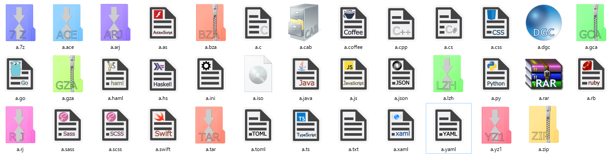

---
categories:
- "icon"
date: 2016-08-08T9:50:53+09:00
draft: false
tags:
- "圧縮"
title: "自作アイコンを作った"
disqus_title: "windows/icon"
---
元々Win8のときは  
{}のgallery0027.7zの  
<!--more-->
ものを使っていたんですが、  
Win10でフォルダアイコンが変わったので  
合わないので自分で作りました

(.pyと.xmlと.htmlが抜けてる...)

いい感じにできました(なんかwindowsのレジストリが意味不明でアイコンの適応が謎)

需要ないとおもいますがzipおいておきます
{}
